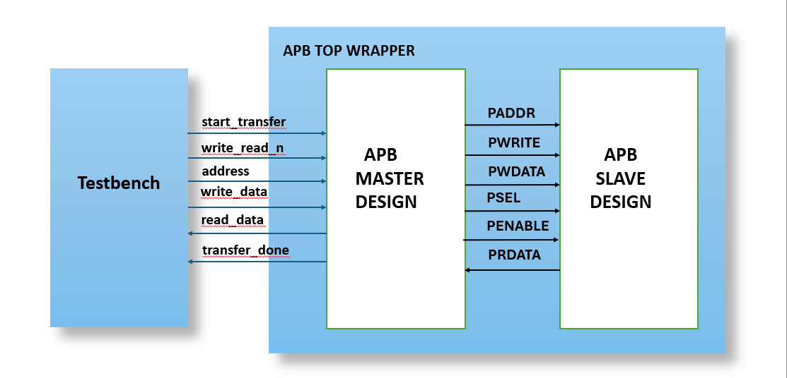

# AMBA APB v3.0 Verification Environment

## Overview
This repository contains a SystemVerilog-based verification environment for an AMBA APB (Advanced Peripheral Bus) v3.0 Bridge. The project demonstrates a layered testbench architecture used to verify the protocol compliance of Master and Slave bridging logic.

## Directory Structure
* **rtl/**: Contains the synthesizable Design Under Test (DUT).
  * `design.sv`: The APB Slave/Bridge RTL.
* **tb/**: Contains the verification components.
  * `testbench.sv`: Top-level testbench environment.
  * `apb_master.sv`: Master Bus Functional Model (BFM).
  * `apb_slave.sv`: Slave BFM / Monitor components.

## 📷 Verification Architecture

This environment uses a layered architecture where the Master BFM generates traffic and the Slave BFM simulates peripheral responses with random wait-states.

## 📄 Documentation
For a detailed explanation of the protocol, FSM design, and signal descriptions, please refer to the project presentation:
[**👉 View Project Presentation (PDF)**](docs/AMBA_APB_Project_Documentation.pdf)

## 📊 Simulation Results
Below is a waveform capture showing a successful Write followed by a Read transaction.

## Features Verified
* **Protocol Compliance**: Checks PSEL, PENABLE, and PREADY handshake mechanisms.
* **Data Integrity**: Verifies that `PWDATA` written by the master matches `PRDATA` read from the slave.
* **Corner Cases**:
  * Back-to-back transfers (No wait states).
  * Wait states injection (using `PREADY` randomization).
  * Error responses (`PSLVERR`).

## Tools Used
* **Language**: SystemVerilog
* **Simulator**: EDA Playground 

## 🚀 Run Online
You can simulate this project directly in your browser using EDA Playground:
[**🔗 Click here to run the Simulation on EDA Playground**](https://www.edaplayground.com/x/N6Zm)

## How to Run
1. Clone the repository.
2. Compile the `rtl/design.sv` and `tb/` files together.
3. Observe the waveforms to verify the APB state machine transitions (IDLE -> SETUP -> ACCESS).
