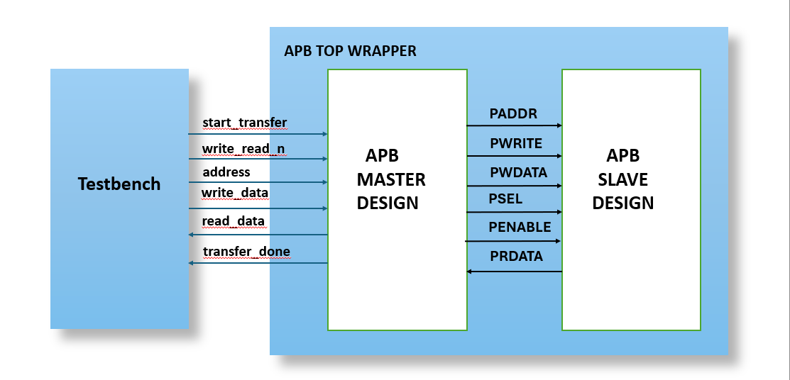
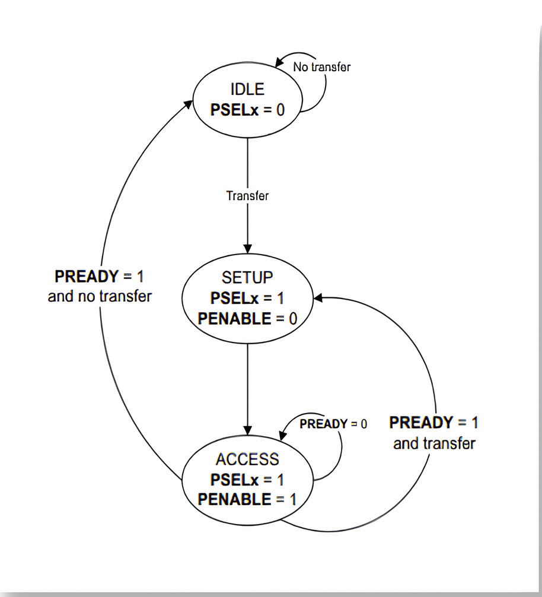
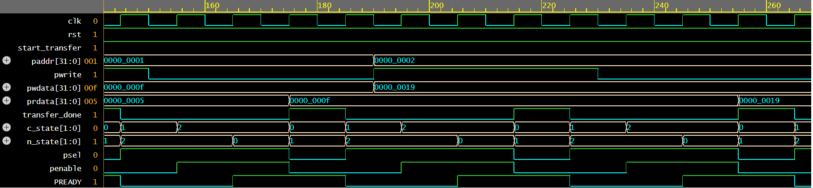

# AMBA APB Bridge — Verification Environment with SVA Assertions

## Overview
This repository contains a complete SystemVerilog-based verification environment for an AMBA APB (Advanced Peripheral Bus) v3.0 Bridge. The project has two main parts — a 4-layer self-checking testbench with an address-mapped scoreboard, and a 14-property SVA assertion suite that covers the full APB protocol lifecycle. All assertions are written in a separate bind file so the RTL is never modified.

## Directory Structure
* **rtl/**: Contains the synthesizable Design Under Test (DUT).
  * `design.sv`: APB top-level connecting master, slave, and interface.
  * `apb_master.sv`: APB Master FSM — drives PSEL, PENABLE, PADDR, PWDATA.
  * `apb_slave.sv`: APB Slave with 16-entry memory — responds with PRDATA and PREADY.
* **tb/**: Contains the verification components.
  * `testbench.sv`: Top-level testbench — generator, driver, monitor, scoreboard.
  * `apb_assertion.sv`: SVA property module — 14 assertions across 4 blocks, bind-based.
* **docs/**: Project documentation and visual references.
  * `block_diagram.png`: Testbench architecture block diagram.
  * `fsm_diagram.png`: APB Master FSM state diagram.
  * `waveform_result.png`: Simulation waveform showing write and read transactions.

## 📷 Verification Architecture

This environment uses a layered architecture where each component has one clear responsibility:

* **Generator** — creates randomised read/write transaction packets
* **Driver** — drives packets onto the virtual interface
* **Monitor** — captures completed transactions (`psel && penable && pready`) only
* **Scoreboard** — maintains a reference memory (`ref_mem[0:15]`); stores data on writes and compares `prdata` against the stored value on reads

Communication between components uses mailboxes. A semaphore prevents drive/monitor conflicts on the shared interface.

## Finite State Machine (Master)
The APB Master follows a 3-state FSM to ensure protocol compliance — no transfer can skip a phase.

* **IDLE** — bus is free, no transfer in progress
* **SETUP** — PSEL goes high; master presents PADDR, PWRITE, and PWDATA
* **ACCESS** — PENABLE goes high; slave responds with PREADY; transfer completes

## SVA Assertion Suite
The assertion file `apb_assertion.sv` binds to the DUT and contains 14 properties organised into 4 structured blocks:

### Block 1 — Reset Assertions (3 properties)
Verifies that all bus signals return to a clean state when `PRESETn` is deasserted.
* `reset_state` — PSEL and PENABLE must be 0 during reset
* `reset_signal` — PADDR, PWDATA, PRDATA, PWRITE must all be 0 during reset
* `reset_handshake` — PREADY and transfer_done must be 0 during reset

### Block 2 — State Invariant Assertions (5 properties)
Verifies that signals hold correct values *while inside* each state, regardless of how the FSM entered that state.
* `setup_signal` — PADDR and PWRITE must not be X during SETUP
* `setup_wdata_valid` — PWDATA must not be X during SETUP on a write transaction
* `access_signal` — PADDR and PWRITE must not change during ACCESS
* `access_wdata_stable` — PWDATA must not change during ACCESS on a write transaction
* `access_read` — PRDATA must not be X when slave responds to a read

### Block 3 — State Transition Assertions (4 properties)
Verifies that the FSM always moves through states in the correct order — no illegal jumps or skipped phases.
* `transition1` — PSEL can only rise from IDLE (`$past(psel == 0 && penable == 0)`)
* `transition2` — PENABLE can only rise after PSEL was already high — SETUP cannot be skipped
* `transition2_data_stable` — PADDR and PWRITE must not change between SETUP and ACCESS
* `transition3` — After PREADY, bus must return to IDLE on the next cycle

### Block 4 — Data Integrity Assertions (4 properties)
Verifies that transfer completion signalling behaves correctly and cannot fire spuriously.
* `transfer_done_rises` — transfer_done must rise after ACCESS completes
* `transfer_done_one_cycle` — transfer_done must fall the very next cycle — one-cycle pulse only
* `transfer_done_requires_access` — transfer_done must never rise without a prior `psel && penable && pready`
* `error_response` — transfer_done must still rise when PSLVERR is high alongside PREADY

## Bugs Found During Verification
* **Scoreboard not comparing data** — original scoreboard printed received data but never compared it against expected. A data corruption bug would have passed silently. Fixed by implementing address-mapped reference memory.
* **PREADY timing in slave RTL** — slave was registering PREADY one cycle after `PSEL && PENABLE`, creating a timing mismatch with the master. Fixed to drive PREADY in the same ACCESS cycle for zero wait-state transfers.
* **Duplicate $stable check in assertions** — `$stable(pwdata)` appeared twice in the ACCESS invariant while `$stable(pwrite)` was missing. Found during assertion review and fixed.

## Functional Coverage
Coverage is implemented using a covergroup with cross coverage across `pwrite`, `paddr`, and `pwdata`. Explicit bins cover:
* Write and read transactions across all 16 slave addresses
* Back-to-back write followed by read to the same address
* Back-to-back read followed by write

## 📊 Simulation Results
Below is a waveform capture showing a successful Write followed by a Read transaction, with all assertions passing.

## Features Verified
* **Protocol Compliance** — PSEL, PENABLE, and PREADY handshake sequencing across all phases
* **State Machine Correctness** — IDLE → SETUP → ACCESS → IDLE ordering enforced by assertions
* **Data Integrity** — PWDATA written by master matches PRDATA read from slave, verified per address
* **Signal Stability** — PADDR, PWRITE, PWDATA stable during ACCESS phase
* **Corner Cases**:
  * Back-to-back transfers with no wait states
  * PSLVERR error response handling
  * Reset mid-transfer behaviour

## Tools Used
* **Language**: SystemVerilog (IEEE 1800-2017)
* **Simulator**: EDA Playground (Aldec Riviera-PRO / Cadence Xcelium)

## 🚀 Run Online
You can simulate this project directly in your browser using EDA Playground:

[**🔗 Click here to run the Simulation on EDA Playground**](https://www.edaplayground.com/x/N6Zm)

## How to Run on EDA Playground
1. Go to [edaplayground.com](https://edaplayground.com) and create a new playground
2. Select **SystemVerilog** as the language
3. Select **Aldec Riviera-PRO** or **Cadence Xcelium** as the simulator
4. Add files in this order: `apb_slave.sv` → `apb_master.sv` → `design.sv` → `apb_assertion.sv` → `testbench.sv`
5. Tick **Open EPWave** to view waveforms after simulation
6. Click **Run** — assertion pass/fail messages will appear in the log

## How to Run Locally
1. Clone the repository
2. Compile all files together with a SystemVerilog-compatible simulator
3. Check the simulation log for assertion results and scoreboard pass/fail messages
4. View waveforms to inspect APB state machine transitions (IDLE → SETUP → ACCESS → IDLE)
